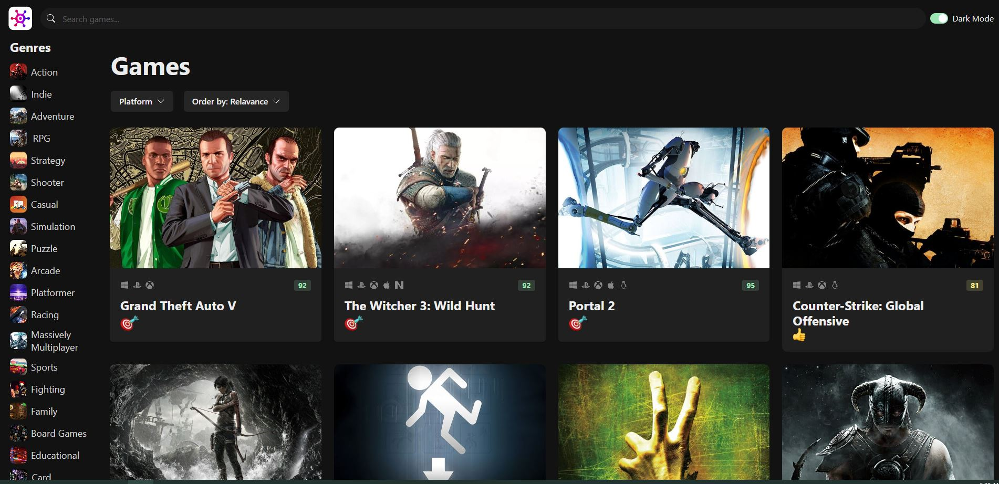
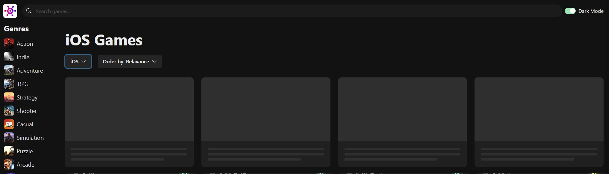
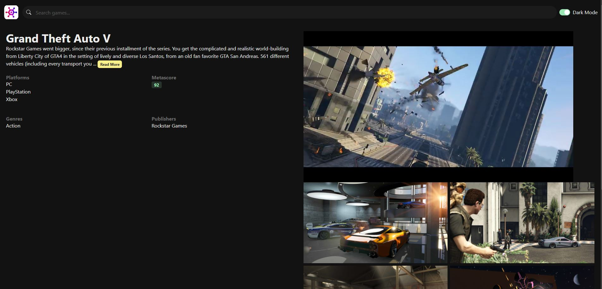
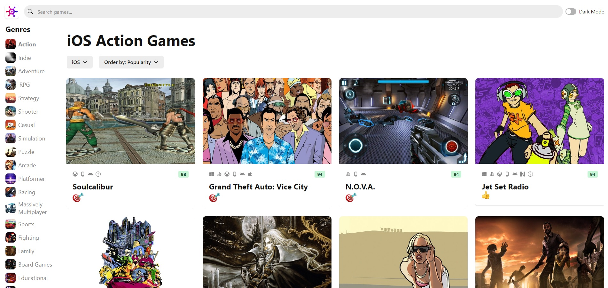

# Game Hub (Project 03 - Basic React + Typescript)

# 

# Game Hub

<table>
<tr>
<td>
  - This app is a frontpage, implement rawg.io API to query and sort games.
  - 3 types of query/sort: Genre, Platform, and SortOrder (Relavance, Date added, ...)
 </td>
</tr>
<tr>
<td>
  - Technologies: React, Vite, Typescript, Chakra-ui
 </td>
</tr>
</table>

## Demo: https://game-hub-project3.vercel.app/

## Built with

Vite, React, Typescript, ChakraUI

## How to build: React, Vite, Typescript, Chakra-ui

- npm create vite@4.1.0
- npm i
- npm run dev
- gh auth login
- gh repo create `<`repo-name`>` --public
- git remote add origin https://github.com/luongkhdang/Project3-GameHub
- git push -u origin master

- npm i @chakra-ui/react @emotion/react @emotion/styled framer-motion
- npm i react-icons@4.7.1
- npm i react-infinite-scroll-component@6.1
- npm i ms@2.1.3
- npm i -D @types/ms //dev only

---

- PROJECT 3.1

- npm i @tanstack/react-query@4.28
- npm i @tanstack/react-query-devtools@4.28
- npm i zustand@4.3.7
- npm i simple-zustand-devtools@1.1.0
- npm i -D @types/node

import { QueryClient, QueryClientProvider } from '@tanstack/react-query';
import { ReactQueryDevtools } from "@tanstack/react-query-devtools";

REFACTOR:

- app.tsx: In project 3, we use state hook to maintain some local state (gameQuery). We will refactor to reducers to centralize the state management logic using Zustand State Management Library. Then, we use ReactContext to share our gameQuery to any component in this tree. "store"

---

- Project 3.2 - Routes

- npm i react-router-dom@6.10.0

### Landing Page

> > 

### Loading Screen

> > 

### Game Detail Page

> > 

### Light Mode

> > 

## Mobile support

### Development

Want to contribute? Great!

To fix a bug or enhance an existing module, follow these steps:

### Bug / Feature Request

## To-do

## Team

[Luong Dang](https://github.com/luongkhdang)

## [License](https://github.com/luongkhdang/xxxxx/LICENSE.md)

MIT © [Luong Dang ](https://github.com/luongkhdang)

----------------------
SELF NOTE:
read the docs of the following:

fetching data with cache, cancel query

event.preventDefault(), useRef,
axios : axios, APIClient (axios.create, endpoint, getAll) AxiosRequestConfig, CanceledError
useContext , react.createContext

@tanstack/react-query 
	QueryClient, setQueryData
	useQuery, 
	useQueryClient
	useInfiniteQuery,  fetchNextPage
	useMutation

react-infinite-scroll-component
zustand - create 
	- simple-zustand=devtools@1.1.0

react-router-dom@6.10.0
	- createBrowserRouter
	- Link 
	- usenavigate
	- useParams
	- useSearchParams
	- useLocation
	- Outlet (is child)
	- useRouteError , isRouteErrorResponse
 
 ----------------------
